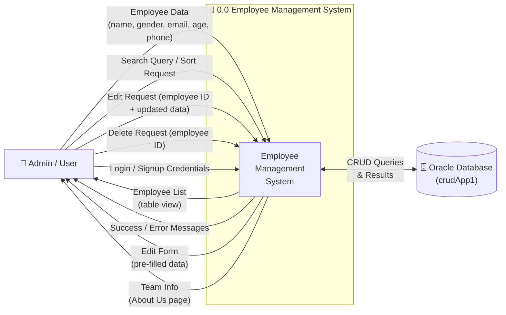
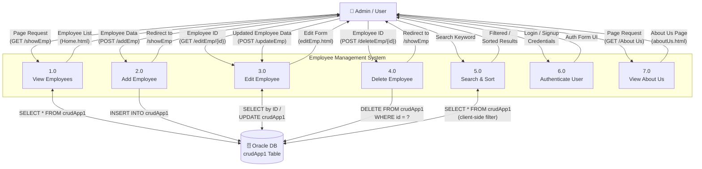
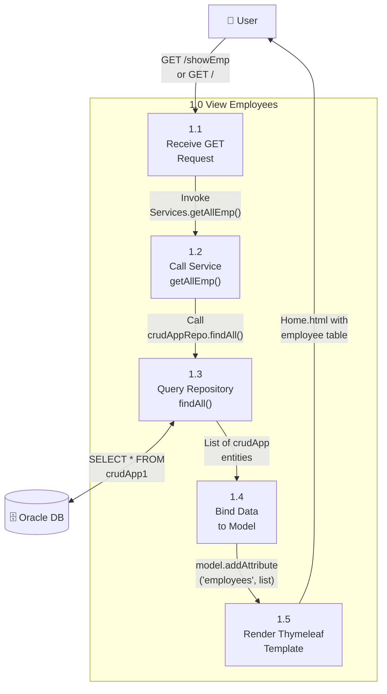
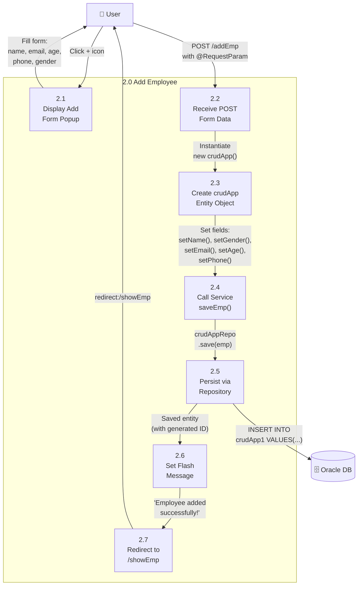
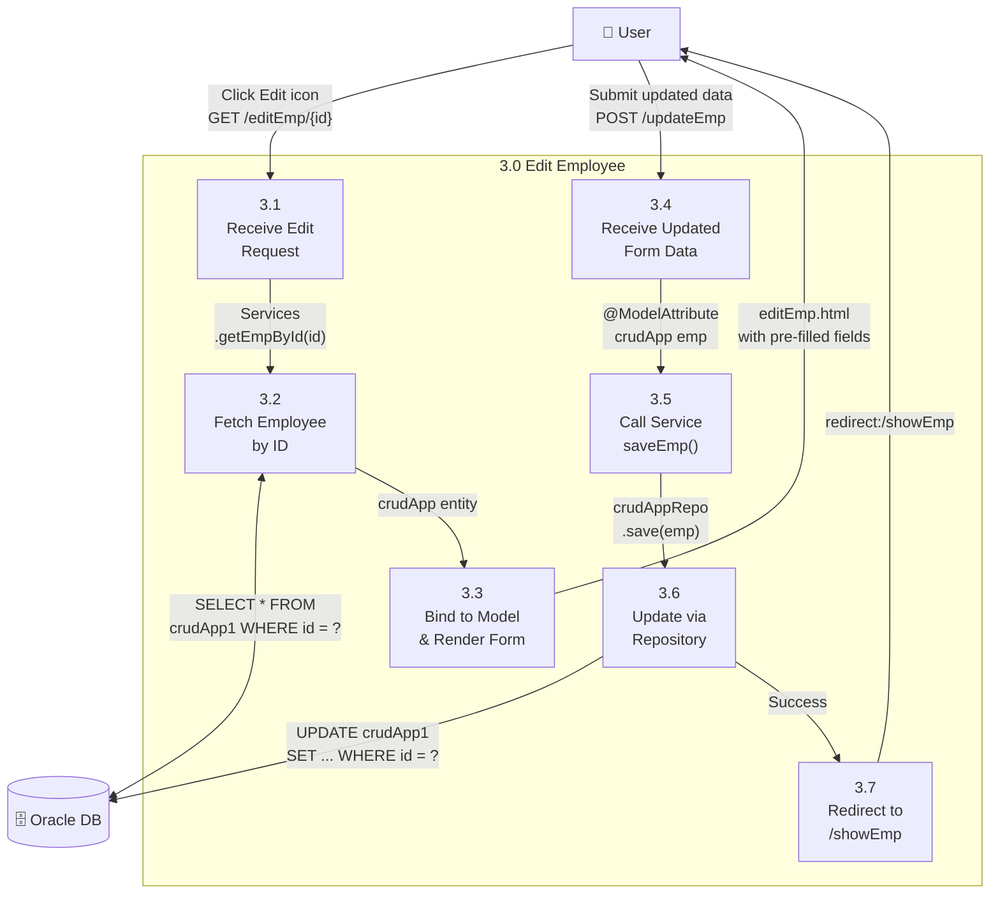
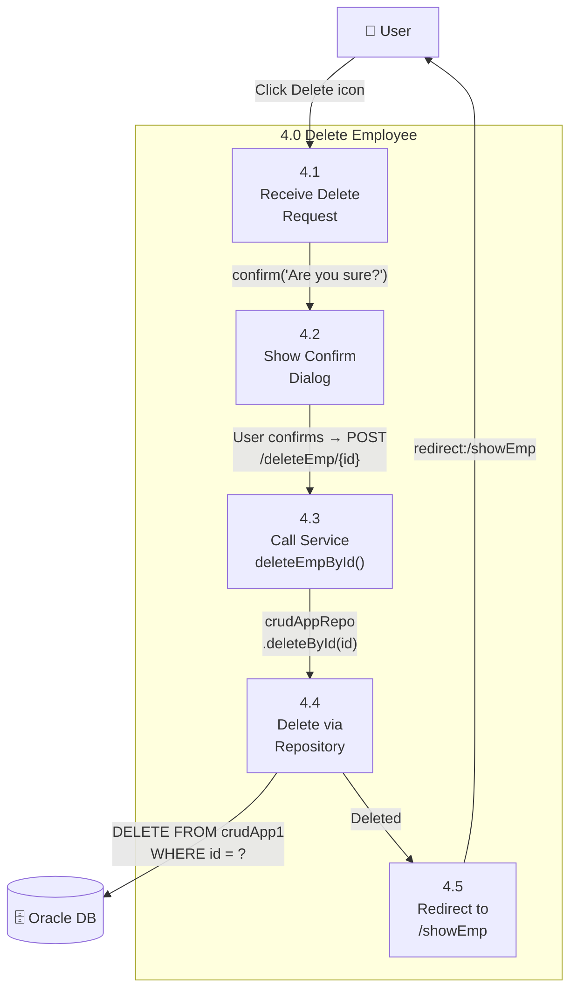
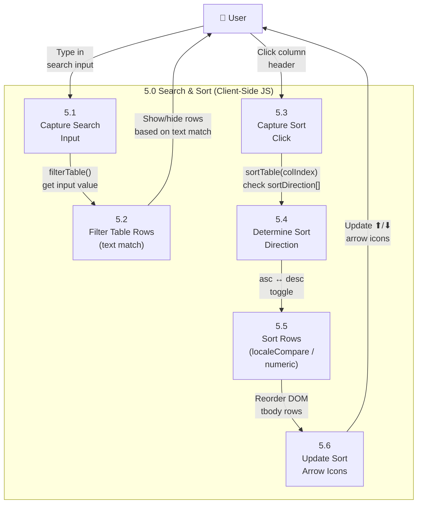

# 📊 Data Flow Diagrams — Employee Management System

> DFD Level 0 (Context), Level 1 (System Overview), and Level 2 (Detailed Processes)  
> **Project**: Spring Boot CRUD Application | **Team SAM** — KIIT University

---

## 📘 DFD Notation Guide

| Symbol | Meaning |
|--------|---------|
| **Rectangle** | External Entity (User/Actor) |
| **Rounded/Circle** | Process |
| **Open Rectangle (parallel lines)** | Data Store |
| **Arrow** | Data Flow (labeled with data name) |

---

## 🔵 Level 0 — Context Diagram

The highest-level view showing the entire system as a single process interacting with external entities.

**Summary**: A single user (Admin) interacts with the Employee Management System to manage employee records. The system reads/writes data to an Oracle Database.

---

## 🟢 Level 1 — System Overview

Breaks the system into its major processes.

> [!NOTE]
> **Process 5.0 (Search & Sort)** operates entirely on the client side via JavaScript. The data is already loaded in the table; filtering/sorting happens in the browser without additional DB queries.

> [!NOTE]
> **Process 6.0 (Authenticate User)** is currently UI-only — the login/signup forms have no backend integration.

---

## 🟠 Level 2 — Detailed Process Decomposition

### 2.1 — Process 1.0: View Employees (Detailed)

---

### 2.2 — Process 2.0: Add Employee (Detailed)

---

### 2.3 — Process 3.0: Edit Employee (Detailed)

---

### 2.4 — Process 4.0: Delete Employee (Detailed)

---

### 2.5 — Process 5.0: Search & Sort (Detailed)

> [!IMPORTANT]
> This entire process runs in the **browser** (client-side JavaScript). No server calls are made — all data is already present in the HTML table rendered by Thymeleaf.

---

## 📐 Data Dictionary

| Data Flow | Contents | Format | Source → Destination |
|-----------|----------|--------|---------------------|
| **Employee Data** | name, gender, email, age, phone | Form POST params | User → System |
| **Employee ID** | Unique auto-generated Long | Path variable `{id}` | User → System |
| **Employee List** | Array of all employee records | Thymeleaf model attribute | DB → System → User |
| **Edit Form Data** | Pre-filled employee fields | Thymeleaf `th:field` bindings | DB → System → User |
| **Search Keyword** | Free-text string | JS input event value | User → Browser (JS) |
| **Sort Request** | Column index + direction | JS click handler params | User → Browser (JS) |
| **Flash Message** | Success/error string | `RedirectAttributes` | System → User |
| **CRUD Queries** | SQL INSERT/SELECT/UPDATE/DELETE | JPA-generated SQL | System → Oracle DB |

---

## 🏛️ Data Stores

| Store ID | Name | Implementation | Contents |
|----------|------|----------------|----------|
| **D1** | Employee Database | Oracle DB table `crudApp1` | All employee records (id, name, gender, email, age, phone) |
| **D2** | Session/Browser | Client-side DOM | Currently rendered employee table rows (for search/sort) |
